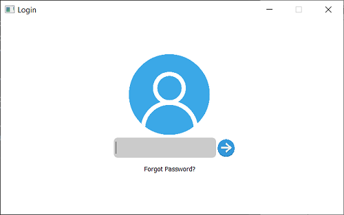
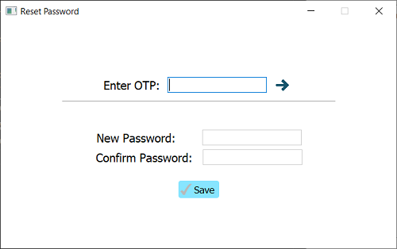
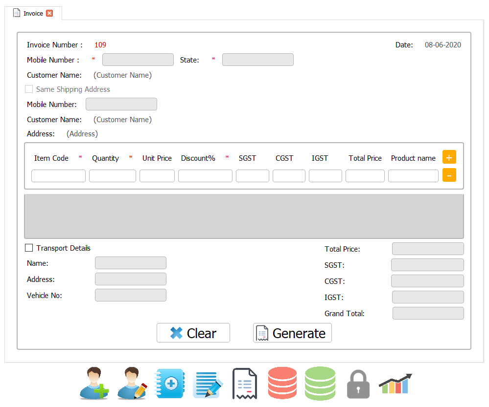

<!-- Step-1 Identify the project -->

# Billing and Management System

[Github Repository](https://github.com/gursimarkaur999/Billing-Project, 'Billing and Management System')

###### By Author Sameer Sharma, Gursimar Kaur
---
<!-- Step-2 Evaluate the project -->
With our project you can update the traditional billing mechanism and do the data collection digitally with which our project will create data analysis graphs demonstrating growth of business in past month and year. Billing and Management System will help you in doing basic data analysis and you can save the graph's into your system. You'll like our project as there is no need to fetch data outside for basic data analysis.
<!-- Now describe who can use the project -->
### Features
1. SHA-512 Authenticated system
2. Digitally manages bills and records of customer's as well as items/products of a company.
3. Easy saving bill in PDF format as well as bill printing facility.
4. OTP on e-mail as well as registered phone number.
5. Data representation in form of graphs monthly/ yearly.
### Users
* Large scale companies to small Local vendors. (Anyone who deals with the bills, wants basic data analysis can use this system.)
---
<!-- Step-3 Help reader to use the project -->

### Project Prerequisties
Before cloning our project you require:
* Python3
* Python Editor (Required python3 must be in path 
variable)
* XAMPP server

### Installation Steps
1. Clone the repository.
2. Open project in editor.
3. Install all 'requirement.txt' file packages or u can use command as shown below:
    ```python
    pip install -r requirements.txt
    ```
    _**Note**: Refer to [link](https://github.com/sameersharma1999/Billing-Project) for proper understanding._
4. Setup database file **'billing.sql'** as follows:
    1. Open XAMPP control panel and start Apache and MySQL.
    2. Click on 'Admin'.
    3. Create a database with name 'billing'.
    4. Open import panel in 'billing' database.
    5. Browse to the 'billing.sql' file in the project and simple click 'OK'.
    6. Go to passwords > SQL, copy and paste the following command: 
    ```sql
    UPDATE `passwords` SET `email`='write your email id',`ph_no`='write your phone number' WHERE 1
    ```
    7. Modify it by writing email ID and phone number and click on 'GO'.
5. Open App > Frontend > main_window.py and execute this file.
6. Following screen will appear:
    
7. Click on 'Forget Password' and change password from OTP on registered email ID or phone number.
    
8. Now enter your new password and you are good to go.
    
    
---
<!-- Step-4 Engage -->
<!-- How to report a Bug -->
### How to report bug?
Mail us at gursimarkaur725@gmail.com
